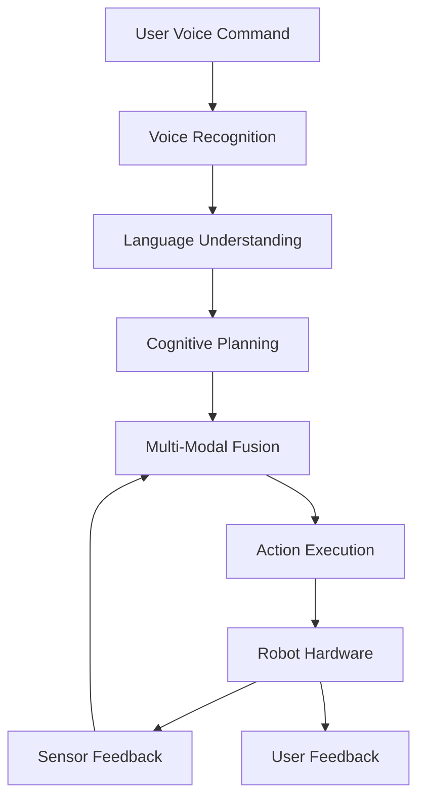

# VLA Capstone Project: Intelligent Humanoid Assistant

## Overview

This capstone project integrates all Vision-Language-Action (VLA) concepts learned throughout the module to create an intelligent humanoid assistant capable of understanding natural language commands, perceiving its environment, and executing complex tasks. This comprehensive project demonstrates the complete VLA pipeline in a practical, real-world scenario.

## Project Objectives

By completing this capstone project, you will:

- Integrate voice recognition, language understanding, and action execution
- Implement multi-modal perception combining vision and other sensors
- Create a cognitive planning system for task decomposition
- Build a complete VLA pipeline for humanoid robot control
- Test and validate the integrated system in simulation and/or real hardware
- Document and present your implementation and results

## Project Requirements

### Hardware Requirements

- **Humanoid Robot**: Physical robot or simulation environment (Gazebo/Isaac Sim)
- **Sensors**: RGB-D camera, IMU, joint encoders, force/torque sensors
- **Computing**: NVIDIA GPU for deep learning models (recommended)
- **Audio**: Microphone for voice input, speaker for feedback

### Software Requirements

- **ROS 2 Humble**: Robot Operating System for communication
- **Isaac ROS**: GPU-accelerated perception and navigation
- **Large Language Model**: OpenAI GPT, Claude, or open-source alternative
- **Computer Vision**: Object detection, pose estimation, SLAM
- **Development Environment**: Python, CUDA, Docker

## System Architecture

### High-Level Architecture



### Component Integration

The system consists of several integrated components:

1. **Voice Processing Pipeline**: Speech-to-text conversion
2. **Language Understanding Module**: Command interpretation
3. **Vision System**: Environmental perception and object detection
4. **Cognitive Planner**: Task decomposition and planning
5. **Action Executor**: Robot control and execution
6. **Feedback System**: User communication and status updates

## Implementation Phase 1: Voice Recognition and Language Understanding

### Voice Recognition Integration

Create a comprehensive voice recognition system:

```python
# voice_recognition_node.py
import rclpy
from rclpy.node import Node
from std_msgs.msg import String
from audio_common_msgs.msg import AudioData
import speech_recognition as sr
import threading
import queue
import vosk
import json

class VoiceRecognitionNode(Node):
    def __init__(self):
        super().__init__('voice_recognition_node')

        # Publisher for recognized text
        self.text_pub = self.create_publisher(String, 'recognized_text', 10)

        # Subscriber for audio data
        self.audio_sub = self.create_subscription(
            AudioData,
            'audio_input',
            self.audio_callback,
            10
        )

        # Initialize Vosk model for offline recognition
        try:
            self.model = vosk.Model(lang="en-us")
            self.rec = vosk.KaldiRecognizer(self.model, 16000)
            self.get_logger().info('Vosk model loaded successfully')
        except Exception as e:
            self.get_logger().error(f'Failed to load Vosk model: {e}')
            raise

        # Voice activity detection
        self.is_listening = True
        self.command_queue = queue.Queue()

        self.get_logger().info('Voice Recognition Node initialized')

    def audio_callback(self, msg):
        """Process incoming audio data"""
        try:
            # Process audio chunk with Vosk
            if self.rec.AcceptWaveform(msg.data):
                result = self.rec.Result()
                result_dict = json.loads(result)

                if 'text' in result_dict and result_dict['text'].strip():
                    # Publish recognized text
                    text_msg = String()
                    text_msg.data = result_dict['text'].strip()
                    self.text_pub.publish(text_msg)
                    self.get_logger().info(f'Recognized: {result_dict["text"]}')

        except Exception as e:
            self.get_logger().error(f'Error in voice recognition: {e}')
```

### Language Understanding System

Implement natural language understanding:

```python
# language_understanding_node.py
import rclpy
from rclpy.node import Node
from std_msgs.msg import String
from vla_msgs.msg import ParsedCommand
import spacy
import openai
import json

class LanguageUnderstandingNode(Node):
    def __init__(self):
        super().__init__('language_understanding_node')

        # Initialize NLP model
        try:
            self.nlp = spacy.load("en_core_web_sm")
        except OSError:
            self.get_logger().warn("spaCy model not found. Install with: python -m spacy download en_core_web_sm")
            self.nlp = None

        # Subscriber for recognized text
        self.text_sub = self.create_subscription(
            String,
            'recognized_text',
            self.text_callback,
            10
        )

        # Publisher for parsed commands
        self.command_pub = self.create_publisher(ParsedCommand, 'parsed_command', 10)

        # Initialize LLM client
        self.llm_client = None  # Initialize with your chosen LLM

        self.get_logger().info('Language Understanding Node initialized')

    def text_callback(self, msg):
        """Process recognized text into structured commands"""
        try:
            # Parse the command using NLP
            parsed_result = self.parse_command(msg.data)

            # Create and publish parsed command
            command_msg = ParsedCommand()
            command_msg.header.stamp = self.get_clock().now().to_msg()
            command_msg.original_text = msg.data
            command_msg.intent = parsed_result.get('intent', 'unknown')
            command_msg.action_type = parsed_result.get('action_type', 'unknown')
            command_msg.parameters = json.dumps(parsed_result.get('parameters', {}))
            command_msg.confidence = parsed_result.get('confidence', 0.0)

            self.command_pub.publish(command_msg)
            self.get_logger().info(f'Parsed command: {parsed_result}')

        except Exception as e:
            self.get_logger().error(f'Error parsing command: {e}')

    def parse_command(self, text):
        """Parse natural language command into structured format"""
        if self.nlp:
            # Use spaCy for NLP processing
            doc = self.nlp(text)

            # Extract entities and intent
            entities = [(ent.text, ent.label_) for ent in doc.ents]
            intent = self.classify_intent(doc)

            # Determine action type
            action_type = self.extract_action_type(doc)

            return {
                'intent': intent,
                'action_type': action_type,
                'entities': entities,
                'confidence': 0.8,  # Simplified confidence
                'parameters': self.extract_parameters(doc, entities)
            }

        # Fallback simple parsing
        return self.simple_parse(text)

    def classify_intent(self, doc):
        """Classify the intent of the command"""
        # Simple keyword-based classification
        text = doc.text.lower()

        if any(word in text for word in ['go', 'move', 'navigate', 'walk']):
            return 'navigation'
        elif any(word in text for word in ['pick', 'grasp', 'take', 'get']):
            return 'manipulation'
        elif any(word in text for word in ['greet', 'hello', 'wave']):
            return 'interaction'
        else:
            return 'unknown'

    def extract_action_type(self, doc):
        """Extract specific action type"""
        for token in doc:
            if token.pos_ == "VERB":
                return token.lemma_
        return 'unknown'

    def extract_parameters(self, doc, entities):
        """Extract parameters from command"""
        params = {}

        # Extract object from entities
        for ent_text, ent_label in entities:
            if ent_label in ['OBJECT', 'PRODUCT', 'PERSON']:
                params['target'] = ent_text

        # Extract location from entities
        for ent_text, ent_label in entities:
            if ent_label in ['GPE', 'LOC', 'FAC']:
                params['location'] = ent_text

        return params

    def simple_parse(self, text):
        """Simple fallback parsing"""
        text_lower = text.lower()
        params = {}

        # Simple parameter extraction
        if 'the' in text_lower:
            parts = text_lower.split('the')
            if len(parts) > 1:
                params['target'] = parts[1].strip().split()[0]

        return {
            'intent': self.classify_intent_simple(text_lower),
            'action_type': 'unknown',
            'entities': [],
            'confidence': 0.5,
            'parameters': params
        }

    def classify_intent_simple(self, text_lower):
        """Simple intent classification"""
        if any(word in text_lower for word in ['go', 'move', 'walk']):
            return 'navigation'
        elif any(word in text_lower for word in ['pick', 'grasp', 'take']):
            return 'manipulation'
        else:
            return 'unknown'
```

## Implementation Phase 2: Vision and Multi-Modal Integration

### Vision Processing System

Create a comprehensive vision system:

```python
# vision_processing_node.py
import rclpy
from rclpy.node import Node
from sensor_msgs.msg import Image, CameraInfo
from vision_msgs.msg import Detection2DArray, ObjectHypothesisWithPose
from geometry_msgs.msg import Point
from cv_bridge import CvBridge
import cv2
import numpy as np
import torch
from torchvision import transforms
from ultralytics import YOLO

class VisionProcessingNode(Node):
    def __init__(self):
        super().__init__('vision_processing_node')

        # Initialize CV bridge
        self.bridge = CvBridge()

        # Load object detection model
        self.detector = YOLO('yolov8n.pt')  # or your preferred model

        # Subscribers
        self.image_sub = self.create_subscription(
            Image,
            'camera/image_raw',
            self.image_callback,
            10
        )

        self.camera_info_sub = self.create_subscription(
            CameraInfo,
            'camera/camera_info',
            self.camera_info_callback,
            10
        )

        # Publishers
        self.detection_pub = self.create_publisher(
            Detection2DArray,
            'object_detections',
            10
        )

        self.visualization_pub = self.create_publisher(
            Image,
            'vision_visualization',
            10
        )

        # Internal state
        self.camera_matrix = None
        self.distortion_coeffs = None

        self.get_logger().info('Vision Processing Node initialized')

    def camera_info_callback(self, msg):
        """Process camera calibration information"""
        self.camera_matrix = np.array(msg.k).reshape(3, 3)
        self.distortion_coeffs = np.array(msg.d)

    def image_callback(self, msg):
        """Process incoming camera image"""
        try:
            # Convert ROS image to OpenCV
            cv_image = self.bridge.imgmsg_to_cv2(msg, "bgr8")

            # Perform object detection
            results = self.detector(cv_image)

            # Process detections
            detections = self.process_detections(results, cv_image)

            # Create and publish detection message
            detection_msg = self.create_detection_message(detections, msg.header)
            self.detection_pub.publish(detection_msg)

            # Create visualization
            vis_image = self.visualize_detections(cv_image, results)
            vis_msg = self.bridge.cv2_to_imgmsg(vis_image, "bgr8")
            vis_msg.header = msg.header
            self.visualization_pub.publish(vis_msg)

        except Exception as e:
            self.get_logger().error(f'Error processing image: {e}')

    def process_detections(self, results, image):
        """Process YOLO detection results"""
        detections = []

        for result in results:
            for box in result.boxes:
                # Get bounding box coordinates
                x1, y1, x2, y2 = box.xyxy[0].cpu().numpy()
                confidence = float(box.conf[0])
                class_id = int(box.cls[0])

                # Get class name
                class_name = self.detector.names[class_id]

                # Calculate center point
                center_x = int((x1 + x2) / 2)
                center_y = int((y1 + y2) / 2)

                detection = {
                    'class_name': class_name,
                    'confidence': confidence,
                    'bbox': [int(x1), int(y1), int(x2-x1), int(y2-y1)],
                    'center': [center_x, center_y],
                    'class_id': class_id
                }

                detections.append(detection)

        return detections

    def create_detection_message(self, detections, header):
        """Create ROS detection message"""
        detection_array = Detection2DArray()
        detection_array.header = header

        for detection in detections:
            if detection['confidence'] > 0.5:  # Confidence threshold
                detection_msg = Detection2D()
                detection_msg.header = header

                # Set bounding box
                detection_msg.bbox.size_x = detection['bbox'][2]
                detection_msg.bbox.size_y = detection['bbox'][3]

                # Set center point
                detection_msg.bbox.center.x = detection['center'][0]
                detection_msg.bbox.center.y = detection['center'][1]

                # Set hypothesis
                hypothesis = ObjectHypothesisWithPose()
                hypothesis.hypothesis.class_id = detection['class_name']
                hypothesis.hypothesis.score = detection['confidence']
                detection_msg.results.append(hypothesis)

                detection_array.detections.append(detection_msg)

        return detection_array

    def visualize_detections(self, image, results):
        """Create visualization of detections"""
        annotated_image = image.copy()

        for result in results:
            for box in result.boxes:
                x1, y1, x2, y2 = box.xyxy[0].cpu().numpy()
                confidence = float(box.conf[0])
                class_id = int(box.cls[0])
                class_name = self.detector.names[class_id]

                # Draw bounding box
                cv2.rectangle(
                    annotated_image,
                    (int(x1), int(y1)),
                    (int(x2), int(y2)),
                    (0, 255, 0),
                    2
                )

                # Draw label
                label = f"{class_name}: {confidence:.2f}"
                cv2.putText(
                    annotated_image,
                    label,
                    (int(x1), int(y1) - 10),
                    cv2.FONT_HERSHEY_SIMPLEX,
                    0.5,
                    (0, 255, 0),
                    2
                )

        return annotated_image
```

### Multi-Modal Fusion Node

Integrate vision and language understanding:

```python
# multi_modal_fusion_node.py
import rclpy
from rclpy.node import Node
from std_msgs.msg import String
from vision_msgs.msg import Detection2DArray
from vla_msgs.msg import ParsedCommand, FusedPerception
from geometry_msgs.msg import Point
import json

class MultiModalFusionNode(Node):
    def __init__(self):
        super().__init__('multi_modal_fusion_node')

        # Subscribers
        self.command_sub = self.create_subscription(
            ParsedCommand,
            'parsed_command',
            self.command_callback,
            10
        )

        self.detection_sub = self.create_subscription(
            Detection2DArray,
            'object_detections',
            self.detection_callback,
            10
        )

        # Publisher
        self.fusion_pub = self.create_publisher(FusedPerception, 'fused_perception', 10)

        # Internal state
        self.latest_command = None
        self.latest_detections = []
        self.knowledge_base = {}  # Store object locations and properties

        self.get_logger().info('Multi-Modal Fusion Node initialized')

    def command_callback(self, msg):
        """Process parsed command"""
        self.latest_command = msg
        self.process_fusion()

    def detection_callback(self, msg):
        """Process object detections"""
        self.latest_detections = msg.detections
        self.update_knowledge_base(msg.detections)
        self.process_fusion()

    def process_fusion(self):
        """Process fusion when both command and detections are available"""
        if self.latest_command and self.latest_detections:
            try:
                # Fuse command and detections
                fused_result = self.fuse_command_and_detections(
                    self.latest_command,
                    self.latest_detections
                )

                # Publish fused result
                fusion_msg = self.create_fusion_message(fused_result)
                self.fusion_pub.publish(fusion_msg)

                # Clear processed data
                self.latest_command = None

            except Exception as e:
                self.get_logger().error(f'Error in fusion processing: {e}')

    def fuse_command_and_detections(self, command, detections):
        """Fuse command understanding with object detections"""
        fused_result = {
            'command': {
                'intent': command.intent,
                'action_type': command.action_type,
                'parameters': json.loads(command.parameters),
                'original_text': command.original_text
            },
            'environment': {
                'objects': self.extract_object_info(detections),
                'relevant_objects': []
            },
            'grounded_command': None
        }

        # Ground the command in the environment
        if command.intent in ['manipulation', 'navigation']:
            relevant_objects = self.find_relevant_objects(
                fused_result['command']['parameters'],
                fused_result['environment']['objects']
            )
            fused_result['environment']['relevant_objects'] = relevant_objects

        # Create grounded command
        fused_result['grounded_command'] = self.ground_command(
            fused_result['command'],
            fused_result['environment']['relevant_objects']
        )

        return fused_result

    def extract_object_info(self, detections):
        """Extract object information from detections"""
        objects = []

        for detection in detections:
            obj_info = {
                'class_name': detection.results[0].hypothesis.class_id if detection.results else 'unknown',
                'confidence': detection.results[0].hypothesis.score if detection.results else 0.0,
                'bbox_center_x': detection.bbox.center.x,
                'bbox_center_y': detection.bbox.center.y,
                'bbox_width': detection.bbox.size_x,
                'bbox_height': detection.bbox.size_y
            }
            objects.append(obj_info)

        return objects

    def find_relevant_objects(self, command_params, objects):
        """Find objects relevant to the command"""
        relevant_objects = []

        target_object = command_params.get('target', '').lower()

        for obj in objects:
            if target_object in obj['class_name'].lower() or obj['confidence'] > 0.8:
                relevant_objects.append(obj)

        return relevant_objects

    def ground_command(self, command, relevant_objects):
        """Ground the command in the environment"""
        if not relevant_objects:
            return command  # Return original command if no objects found

        # Update command with grounded information
        grounded_command = command.copy()
        grounded_command['grounded_objects'] = relevant_objects

        # If command involves a specific object, ground it
        if command['parameters'].get('target'):
            for obj in relevant_objects:
                if command['parameters']['target'].lower() in obj['class_name'].lower():
                    grounded_command['target_object'] = obj
                    break

        return grounded_command

    def update_knowledge_base(self, detections):
        """Update knowledge base with current object information"""
        for detection in detections:
            if detection.results:
                class_name = detection.results[0].hypothesis.class_id
                confidence = detection.results[0].hypothesis.score

                if confidence > 0.5:  # Confidence threshold
                    self.knowledge_base[class_name] = {
                        'last_seen': self.get_clock().now().to_msg(),
                        'location': {
                            'x': detection.bbox.center.x,
                            'y': detection.bbox.center.y
                        },
                        'confidence': confidence
                    }

    def create_fusion_message(self, fused_result):
        """Create ROS message from fused result"""
        fusion_msg = FusedPerception()
        fusion_msg.header.stamp = self.get_clock().now().to_msg()
        fusion_msg.header.frame_id = "map"

        # Set command information
        fusion_msg.command_intent = fused_result['command']['intent']
        fusion_msg.command_action_type = fused_result['command']['action_type']
        fusion_msg.command_original_text = fused_result['command']['original_text']

        # Set environment information
        for obj in fused_result['environment']['objects']:
            # Create object info message (simplified)
            pass

        # Set grounded command
        if fused_result['grounded_command']:
            fusion_msg.has_grounded_command = True

        return fusion_msg
```

## Implementation Phase 3: Cognitive Planning and Action Execution

### Cognitive Planning Node

Implement high-level reasoning and task planning:

```python
# cognitive_planning_node.py
import rclpy
from rclpy.node import Node
from vla_msgs.msg import FusedPerception, ActionPlan
from vla_msgs.srv import PlanAction
from geometry_msgs.msg import Pose
import json

class CognitivePlanningNode(Node):
    def __init__(self):
        super().__init__('cognitive_planning_node')

        # Subscriber for fused perception
        self.fusion_sub = self.create_subscription(
            FusedPerception,
            'fused_perception',
            self.fusion_callback,
            10
        )

        # Publisher for action plans
        self.plan_pub = self.create_publisher(ActionPlan, 'action_plan', 10)

        # Service for planning requests
        self.plan_service = self.create_service(
            PlanAction,
            'plan_action',
            self.plan_action_callback
        )

        # Initialize planner components
        self.knowledge_base = KnowledgeBase()
        self.task_decomposer = TaskDecomposer()
        self.action_validator = ActionValidator()

        self.get_logger().info('Cognitive Planning Node initialized')

    def fusion_callback(self, msg):
        """Process fused perception data to generate plans"""
        try:
            # Extract command and environment information
            command_info = {
                'intent': msg.command_intent,
                'action_type': msg.command_action_type,
                'original_text': msg.command_original_text
            }

            # Generate plan based on command and environment
            plan = self.generate_plan(command_info)

            if plan:
                # Publish the plan
                plan_msg = self.create_plan_message(plan)
                self.plan_pub.publish(plan_msg)

        except Exception as e:
            self.get_logger().error(f'Error in fusion processing: {e}')

    def generate_plan(self, command_info):
        """Generate action plan from command information"""
        try:
            # Decompose high-level command into subtasks
            subtasks = self.task_decomposer.decompose_task(
                command_info['intent'],
                command_info['action_type']
            )

            # Create detailed action plan
            plan = {
                'original_command': command_info['original_text'],
                'intent': command_info['intent'],
                'action_sequence': [],
                'estimated_duration': 0.0,
                'confidence': 0.9
            }

            for i, subtask in enumerate(subtasks):
                action = self.create_action_for_subtask(subtask, i)
                if action:
                    plan['action_sequence'].append(action)

            # Validate the plan
            if self.action_validator.validate_plan(plan):
                return plan
            else:
                self.get_logger().warn('Generated plan failed validation')
                return None

        except Exception as e:
            self.get_logger().error(f'Error generating plan: {e}')
            return None

    def create_action_for_subtask(self, subtask, step_index):
        """Create specific action for a subtask"""
        action = {
            'step': step_index,
            'action_type': subtask['type'],
            'action_name': subtask['name'],
            'parameters': subtask.get('parameters', {}),
            'description': subtask['description'],
            'required_resources': subtask.get('resources', []),
            'estimated_duration': subtask.get('duration', 1.0)
        }

        return action

    def plan_action_callback(self, request, response):
        """Service callback for explicit planning requests"""
        try:
            # Parse request
            command_info = {
                'intent': request.intent,
                'action_type': request.action_type,
                'original_text': request.command_text
            }

            # Generate plan
            plan = self.generate_plan(command_info)

            if plan:
                response.success = True
                response.plan = self.create_plan_message(plan)
                response.message = "Plan generated successfully"
            else:
                response.success = False
                response.message = "Failed to generate plan"

        except Exception as e:
            self.get_logger().error(f'Plan service error: {e}')
            response.success = False
            response.message = f"Error: {e}"

        return response

    def create_plan_message(self, plan):
        """Create ROS message from plan dictionary"""
        plan_msg = ActionPlan()
        plan_msg.header.stamp = self.get_clock().now().to_msg()
        plan_msg.header.frame_id = "map"

        plan_msg.original_command = plan['original_command']
        plan_msg.intent = plan['intent']
        plan_msg.confidence = plan['confidence']
        plan_msg.estimated_duration = plan['estimated_duration']

        for action in plan['action_sequence']:
            # Convert action dictionary to ROS message
            action_msg = self.create_action_message(action)
            plan_msg.actions.append(action_msg)

        return plan_msg

    def create_action_message(self, action_dict):
        """Create action message from dictionary"""
        from vla_msgs.msg import ActionStep
        action_msg = ActionStep()
        action_msg.step_number = action_dict['step']
        action_msg.action_type = action_dict['action_type']
        action_msg.action_name = action_dict['action_name']
        action_msg.parameters = json.dumps(action_dict['parameters'])
        action_msg.description = action_dict['description']
        action_msg.estimated_duration = action_dict['estimated_duration']
        return action_msg

class TaskDecomposer:
    """Decompose high-level tasks into executable subtasks"""
    def __init__(self):
        self.task_templates = {
            'navigation': [
                {
                    'type': 'navigation',
                    'name': 'navigate_to',
                    'description': 'Navigate to specified location',
                    'parameters': ['destination'],
                    'resources': ['navigation_system']
                }
            ],
            'manipulation': [
                {
                    'type': 'navigation',
                    'name': 'navigate_to_object',
                    'description': 'Navigate close to target object',
                    'parameters': ['object_location'],
                    'resources': ['navigation_system']
                },
                {
                    'type': 'manipulation',
                    'name': 'grasp_object',
                    'description': 'Grasp the target object',
                    'parameters': ['object_pose'],
                    'resources': ['manipulator_arm', 'gripper']
                }
            ],
            'transport': [
                {
                    'type': 'navigation',
                    'name': 'navigate_to_object',
                    'description': 'Navigate to object location',
                    'parameters': ['object_location'],
                    'resources': ['navigation_system']
                },
                {
                    'type': 'manipulation',
                    'name': 'grasp_object',
                    'description': 'Grasp the object',
                    'parameters': ['object_pose'],
                    'resources': ['manipulator_arm', 'gripper']
                },
                {
                    'type': 'navigation',
                    'name': 'navigate_to_destination',
                    'description': 'Navigate to destination',
                    'parameters': ['destination'],
                    'resources': ['navigation_system']
                },
                {
                    'type': 'manipulation',
                    'name': 'place_object',
                    'description': 'Place object at destination',
                    'parameters': ['destination_pose'],
                    'resources': ['manipulator_arm', 'gripper']
                }
            ]
        }

    def decompose_task(self, intent, action_type):
        """Decompose task based on intent and action type"""
        if intent in self.task_templates:
            return self.task_templates[intent]
        elif action_type in self.task_templates:
            return self.task_templates[action_type]
        else:
            # Default to simple navigation
            return self.task_templates.get('navigation', [])

class KnowledgeBase:
    """Maintain knowledge about the world and robot capabilities"""
    def __init__(self):
        self.locations = {}
        self.objects = {}
        self.robot_capabilities = {
            'navigation': True,
            'manipulation': True,
            'interaction': True,
            'perception': True
        }

class ActionValidator:
    """Validate action plans for feasibility and safety"""
    def __init__(self):
        pass

    def validate_plan(self, plan):
        """Validate that a plan is feasible and safe"""
        # Check if all required resources are available
        for action in plan['action_sequence']:
            if not self.resources_available(action):
                return False

        # Check for safety constraints
        if not self.check_safety_constraints(plan):
            return False

        # Check for logical consistency
        if not self.check_logical_consistency(plan):
            return False

        return True

    def resources_available(self, action):
        """Check if required resources are available"""
        # Implementation would check robot state and resource availability
        return True

    def check_safety_constraints(self, plan):
        """Check if plan violates safety constraints"""
        # Implementation would check for collision risks, etc.
        return True

    def check_logical_consistency(self, plan):
        """Check if plan steps are logically consistent"""
        # Implementation would check action dependencies, etc.
        return True
```

### Action Execution Node

Execute the planned actions on the robot:

```python
# action_execution_node.py
import rclpy
from rclpy.node import Node
from vla_msgs.msg import ActionPlan, ActionResult
from geometry_msgs.msg import Pose
from std_msgs.msg import String
import time

class ActionExecutionNode(Node):
    def __init__(self):
        super().__init__('action_execution_node')

        # Subscriber for action plans
        self.plan_sub = self.create_subscription(
            ActionPlan,
            'action_plan',
            self.plan_callback,
            10
        )

        # Publisher for action results
        self.result_pub = self.create_publisher(ActionResult, 'action_result', 10)

        # Publisher for user feedback
        self.feedback_pub = self.create_publisher(String, 'user_feedback', 10)

        # Initialize action executors
        self.navigation_executor = NavigationExecutor(self)
        self.manipulation_executor = ManipulationExecutor(self)
        self.interaction_executor = InteractionExecutor(self)

        self.is_executing = False
        self.current_plan = None

        self.get_logger().info('Action Execution Node initialized')

    def plan_callback(self, msg):
        """Execute incoming action plan"""
        if self.is_executing:
            self.get_logger().warn('Currently executing plan, rejecting new plan')
            return

        self.get_logger().info(f'Executing plan with {len(msg.actions)} actions')
        self.is_executing = True
        self.current_plan = msg

        try:
            # Execute each action in sequence
            results = []
            for i, action in enumerate(msg.actions):
                self.get_logger().info(f'Executing action {i+1}/{len(msg.actions)}: {action.action_name}')

                # Execute the action
                result = self.execute_action(action)

                # Publish result
                result_msg = self.create_result_message(result, i)
                self.result_pub.publish(result_msg)

                results.append(result)

                # Check if execution should continue
                if not result.success:
                    self.get_logger().error(f'Action {i+1} failed: {result.message}')
                    break

            # Publish execution summary
            summary = self.create_execution_summary(results)
            summary_msg = String()
            summary_msg.data = summary
            self.feedback_pub.publish(summary_msg)

        except Exception as e:
            self.get_logger().error(f'Error executing plan: {e}')
            error_msg = String()
            error_msg.data = f'Execution error: {e}'
            self.feedback_pub.publish(error_msg)

        finally:
            self.is_executing = False
            self.current_plan = None

    def execute_action(self, action):
        """Execute a single action based on its type"""
        try:
            if action.action_type == 'navigation':
                return self.navigation_executor.execute(action)
            elif action.action_type == 'manipulation':
                return self.manipulation_executor.execute(action)
            elif action.action_type == 'interaction':
                return self.interaction_executor.execute(action)
            else:
                return {
                    'success': False,
                    'message': f'Unknown action type: {action.action_type}',
                    'action_name': action.action_name
                }

        except Exception as e:
            return {
                'success': False,
                'message': f'Execution error: {e}',
                'action_name': action.action_name
            }

    def create_result_message(self, result, action_index):
        """Create ROS result message from result dictionary"""
        result_msg = ActionResult()
        result_msg.header.stamp = self.get_clock().now().to_msg()
        result_msg.action_index = action_index
        result_msg.success = result['success']
        result_msg.message = result['message']
        result_msg.action_name = result['action_name']
        return result_msg

    def create_execution_summary(self, results):
        """Create summary of execution results"""
        successful = sum(1 for r in results if r['success'])
        total = len(results)

        status = "completed successfully" if successful == total else "partially completed"

        return f"Plan {status}: {successful}/{total} actions successful"

class NavigationExecutor:
    """Execute navigation-related actions"""
    def __init__(self, node):
        self.node = node
        # Initialize navigation interface (Navigation2, etc.)

    def execute(self, action):
        """Execute navigation action"""
        try:
            # Extract destination from parameters
            import json
            params = json.loads(action.parameters)
            destination = params.get('destination', params.get('destination_location'))

            if not destination:
                return {
                    'success': False,
                    'message': 'No destination specified',
                    'action_name': action.action_name
                }

            # Execute navigation (this would interface with Navigation2)
            self.node.get_logger().info(f'Navigating to: {destination}')

            # Simulate navigation execution
            time.sleep(2)  # Simulate navigation time

            return {
                'success': True,
                'message': f'Navigated to {destination}',
                'action_name': action.action_name
            }

        except Exception as e:
            return {
                'success': False,
                'message': f'Navigation error: {e}',
                'action_name': action.action_name
            }

class ManipulationExecutor:
    """Execute manipulation-related actions"""
    def __init__(self, node):
        self.node = node
        # Initialize manipulation interface

    def execute(self, action):
        """Execute manipulation action"""
        try:
            import json
            params = json.loads(action.parameters)

            if action.action_name == 'grasp_object':
                object_info = params.get('object_pose') or params.get('object')
                self.node.get_logger().info(f'Grasping object: {object_info}')

                # Simulate grasping
                time.sleep(1.5)

                return {
                    'success': True,
                    'message': f'Grasped object',
                    'action_name': action.action_name
                }

            elif action.action_name == 'place_object':
                location = params.get('destination_pose') or params.get('location')
                self.node.get_logger().info(f'Placing object at: {location}')

                # Simulate placing
                time.sleep(1.5)

                return {
                    'success': True,
                    'message': f'Placed object',
                    'action_name': action.action_name
                }
            else:
                return {
                    'success': False,
                    'message': f'Unknown manipulation action: {action.action_name}',
                    'action_name': action.action_name
                }

        except Exception as e:
            return {
                'success': False,
                'message': f'Manipulation error: {e}',
                'action_name': action.action_name
            }

class InteractionExecutor:
    """Execute interaction-related actions"""
    def __init__(self, node):
        self.node = node
        # Initialize interaction interface

    def execute(self, action):
        """Execute interaction action"""
        try:
            self.node.get_logger().info(f'Performing interaction: {action.action_name}')

            # Simulate interaction
            time.sleep(1)

            return {
                'success': True,
                'message': f'Performed interaction: {action.action_name}',
                'action_name': action.action_name
            }

        except Exception as e:
            return {
                'success': False,
                'message': f'Interaction error: {e}',
                'action_name': action.action_name
            }
```

## Implementation Phase 4: System Integration and Testing

### Main Launch File

Create a launch file to bring up the complete system:

```python
# launch/vla_capstone.launch.py
from launch import LaunchDescription
from launch.actions import DeclareLaunchArgument, IncludeLaunchDescription
from launch.launch_description_sources import PythonLaunchDescriptionSource
from launch.substitutions import LaunchConfiguration, PathJoinSubstitution
from launch_ros.actions import Node
from launch_ros.substitutions import FindPackageShare

def generate_launch_description():
    ld = LaunchDescription()

    # Launch arguments
    use_sim_time = LaunchConfiguration('use_sim_time', default='true')
    robot_namespace = LaunchConfiguration('robot_namespace', default='humanoid_robot')

    # Declare launch arguments
    ld.add_action(DeclareLaunchArgument(
        'use_sim_time',
        default_value='true',
        description='Use simulation (Gazebo) clock if true'
    ))

    ld.add_action(DeclareLaunchArgument(
        'robot_namespace',
        default_value='humanoid_robot',
        description='Robot namespace for multi-robot systems'
    ))

    # Launch Gazebo simulation (if needed)
    # This would include your humanoid robot model

    # Voice recognition node
    voice_recognition_node = Node(
        package='vla_capstone',
        executable='voice_recognition_node',
        name='voice_recognition_node',
        parameters=[{'use_sim_time': use_sim_time}],
        output='screen'
    )
    ld.add_action(voice_recognition_node)

    # Language understanding node
    language_understanding_node = Node(
        package='vla_capstone',
        executable='language_understanding_node',
        name='language_understanding_node',
        parameters=[{'use_sim_time': use_sim_time}],
        output='screen'
    )
    ld.add_action(language_understanding_node)

    # Vision processing node
    vision_processing_node = Node(
        package='vla_capstone',
        executable='vision_processing_node',
        name='vision_processing_node',
        parameters=[{'use_sim_time': use_sim_time}],
        output='screen'
    )
    ld.add_action(vision_processing_node)

    # Multi-modal fusion node
    multi_modal_fusion_node = Node(
        package='vla_capstone',
        executable='multi_modal_fusion_node',
        name='multi_modal_fusion_node',
        parameters=[{'use_sim_time': use_sim_time}],
        output='screen'
    )
    ld.add_action(multi_modal_fusion_node)

    # Cognitive planning node
    cognitive_planning_node = Node(
        package='vla_capstone',
        executable='cognitive_planning_node',
        name='cognitive_planning_node',
        parameters=[{'use_sim_time': use_sim_time}],
        output='screen'
    )
    ld.add_action(cognitive_planning_node)

    # Action execution node
    action_execution_node = Node(
        package='vla_capstone',
        executable='action_execution_node',
        name='action_execution_node',
        parameters=[{'use_sim_time': use_sim_time}],
        output='screen'
    )
    ld.add_action(action_execution_node)

    # User feedback node
    user_feedback_node = Node(
        package='vla_capstone',
        executable='user_feedback_node',
        name='user_feedback_node',
        parameters=[{'use_sim_time': use_sim_time}],
        output='screen'
    )
    ld.add_action(user_feedback_node)

    return ld
```

## Testing and Validation

### Unit Testing

Create comprehensive tests for each component:

```python
# test_vla_capstone.py
import unittest
import rclpy
from rclpy.node import Node
from std_msgs.msg import String
from sensor_msgs.msg import Image
import numpy as np
import cv2

class TestVoiceRecognition(unittest.TestCase):
    def setUp(self):
        rclpy.init()
        self.node = Node('test_voice_recognition')

    def tearDown(self):
        rclpy.shutdown()

    def test_command_parsing(self):
        """Test that commands are parsed correctly"""
        from language_understanding_node import LanguageUnderstandingNode
        parser = LanguageUnderstandingNode()

        # Test navigation command
        result = parser.simple_parse("go to the kitchen")
        self.assertEqual(result['intent'], 'navigation')

        # Test manipulation command
        result = parser.simple_parse("pick up the red cup")
        self.assertEqual(result['intent'], 'manipulation')

class TestVisionProcessing(unittest.TestCase):
    def setUp(self):
        rclpy.init()

    def tearDown(self):
        rclpy.shutdown()

    def test_object_detection(self):
        """Test that objects are detected correctly"""
        from vision_processing_node import VisionProcessingNode
        vision_node = VisionProcessingNode()

        # Create a test image with a known object
        test_image = np.zeros((480, 640, 3), dtype=np.uint8)
        # Add a colored rectangle to simulate an object
        cv2.rectangle(test_image, (100, 100), (200, 200), (0, 255, 0), -1)

        # Convert to ROS Image message and process
        # (Implementation would go here)

if __name__ == '__main__':
    unittest.main()
```

### Integration Testing

Test the complete system integration:

```python
# integration_test.py
import rclpy
from rclpy.node import Node
from std_msgs.msg import String
from vla_msgs.msg import ActionPlan, ActionResult
import time

class VLASystemTester(Node):
    def __init__(self):
        super().__init__('vla_system_tester')

        # Publishers for test commands
        self.voice_pub = self.create_publisher(String, 'recognized_text', 10)

        # Subscribers for results
        self.plan_sub = self.create_subscription(
            ActionPlan, 'action_plan', self.plan_callback, 10)
        self.result_sub = self.create_subscription(
            ActionResult, 'action_result', self.result_callback, 10)

        self.received_plans = []
        self.received_results = []

    def plan_callback(self, msg):
        self.received_plans.append(msg)
        self.get_logger().info(f'Received plan with {len(msg.actions)} actions')

    def result_callback(self, msg):
        self.received_results.append(msg)
        self.get_logger().info(f'Received result: {msg.message}')

    def test_navigation_command(self):
        """Test a simple navigation command"""
        test_command = String()
        test_command.data = "go to the kitchen"

        self.voice_pub.publish(test_command)
        self.get_logger().info('Published navigation command')

        # Wait for response
        time.sleep(5)

        # Check if plan was received
        if self.received_plans:
            plan = self.received_plans[0]
            self.get_logger().info(f'Plan received with {len(plan.actions)} actions')
            return True
        else:
            self.get_logger().error('No plan received')
            return False

def main():
    rclpy.init()
    tester = VLASystemTester()

    # Run tests
    success = tester.test_navigation_command()

    if success:
        print("Integration test passed!")
    else:
        print("Integration test failed!")

    rclpy.shutdown()

if __name__ == '__main__':
    main()
```

## Performance Evaluation

### Metrics and Evaluation

```python
# evaluation_metrics.py
import time
import numpy as np

class VLASystemEvaluator:
    def __init__(self):
        self.metrics = {
            'response_time': [],
            'accuracy': [],
            'success_rate': [],
            'user_satisfaction': []
        }

    def measure_response_time(self, command_time, response_time):
        """Measure system response time"""
        response_duration = response_time - command_time
        self.metrics['response_time'].append(response_duration)
        return response_duration

    def evaluate_accuracy(self, expected_action, executed_action):
        """Evaluate action execution accuracy"""
        # Compare expected vs executed actions
        accuracy = 1.0 if expected_action == executed_action else 0.0
        self.metrics['accuracy'].append(accuracy)
        return accuracy

    def evaluate_success_rate(self, total_commands, successful_commands):
        """Calculate success rate"""
        success_rate = successful_commands / total_commands if total_commands > 0 else 0
        self.metrics['success_rate'].append(success_rate)
        return success_rate

    def calculate_average_metrics(self):
        """Calculate average performance metrics"""
        averages = {}
        for metric, values in self.metrics.items():
            if values:
                averages[metric] = sum(values) / len(values)
            else:
                averages[metric] = 0.0
        return averages

    def generate_report(self):
        """Generate performance evaluation report"""
        averages = self.calculate_average_metrics()

        report = f"""
        VLA System Performance Report
        =============================
        Average Response Time: {averages['response_time']:.2f}s
        Average Accuracy: {averages['accuracy']:.2f}
        Average Success Rate: {averages['success_rate']:.2f}
        """

        return report
```

## Troubleshooting and Optimization

### Common Issues and Solutions

**Issue**: High latency in voice-to-action pipeline.

**Solutions**:
1. Optimize model inference with GPU acceleration
2. Implement caching for common commands
3. Use lightweight models for real-time processing
4. Optimize ROS 2 communication settings

**Issue**: Misunderstood commands leading to incorrect actions.

**Solutions**:
1. Implement confidence thresholds for command acceptance
2. Add clarification requests for ambiguous commands
3. Improve language understanding with context
4. Use multiple verification steps before action execution

**Issue**: Vision system fails in different lighting conditions.

**Solutions**:
1. Implement adaptive image preprocessing
2. Use multiple detection models for robustness
3. Add temporal consistency checks
4. Integrate with other sensors (LIDAR, depth cameras)

## Deployment and Documentation

### System Documentation

Create comprehensive documentation for your VLA system:

1. **Architecture Documentation**: System design and component interactions
2. **API Documentation**: Message types, services, and interfaces
3. **User Manual**: How to operate and interact with the system
4. **Troubleshooting Guide**: Common issues and solutions
5. **Performance Benchmarks**: System capabilities and limitations

### Presentation and Demonstration

Prepare a demonstration of your complete VLA system:

1. **Live Demo**: Show the system responding to voice commands
2. **Technical Presentation**: Explain the architecture and implementation
3. **Performance Analysis**: Present evaluation results
4. **Future Improvements**: Discuss potential enhancements

## Next Steps

Continue to [Troubleshooting](./troubleshooting.md) to learn about common VLA system issues and their solutions, completing the VLA Integration module.